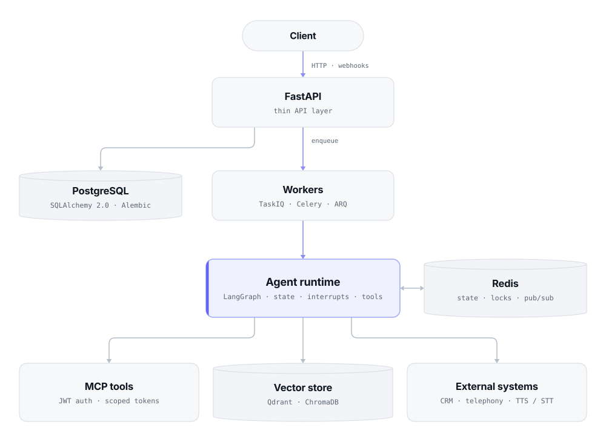
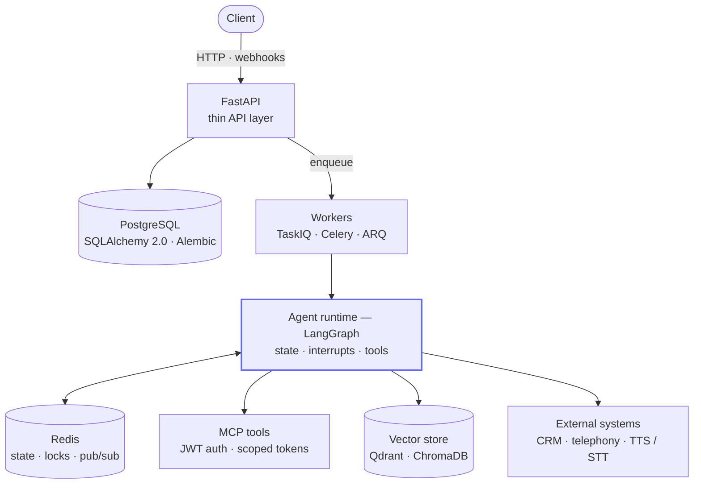

# Andrew Kobelev

**Python Developer · Backend Engineer · AI Engineer**

I build backend systems where AI agents are architectural components — not API wrappers.
Currently a Python developer at a startup working on industrial automation and AI.

---

## Specialization

**AI-powered backend systems and agent architecture.**
The model is one component inside a larger system — bounded by deterministic logic, connected to
tools and knowledge sources, wired into real business processes.

**Deterministic planning, LLM generation.**
Control flow and formally checkable rules live in code; the model handles what genuinely requires
reasoning. A voice agent picks its next script step through a dependency graph, not through model
choice — the LLM only formulates the reply. A document validator runs structural checks in code and
semantic checks as parallel LLM calls.

**Agents as platform components.**
Stateful multi-node graphs with human-in-the-loop interrupts, parallel fan-out, custom reducers for
concurrent writes, and agent authentication with thread ownership. They ship with auth, integration
contracts and offline tests — not as standalone scripts.

**Tools and MCP instead of direct coupling.**
A production MCP server with JWT auth and scoped tokens serves a nested knowledge agent; the calling
agent never touches the protocol. Vector search with metadata filtering and reranking reaches agents
as a tool, not as a chat feature.

**Hard real-time budgets.**
Three concurrent graphs under a 9-second per-turn limit with fallback replies, semaphore-limited
model concurrency, and field-level Redis merges so parallel graphs never overwrite each other.

---

## Engineering Skills

| | |
|---|---|
| **Backend Engineering** | Async services, layered structure, reusable abstractions, task queues with specialized worker pools, distributed locks |
| **System Architecture** | Multi-service decomposition, service boundaries, service-to-service auth, graceful degradation |
| **Agent Architecture** | Graph design, explicit state, interrupts and resumption, tool interfaces, agent authorization |
| **AI Engineering** | Prompting under anti-hallucination constraints, structured outputs, provider fallback, latency and cost budgets |
| **Retrieval & Knowledge** | Vector search with metadata filtering and LLM reranking, exposed to agents through tools |
| **Data & API Design** | Multi-tenant models, hierarchies, explicit state machines, conditional constraints, migration discipline |
| **Integrations & Automation** | CRM, telephony, speech and storage providers; webhooks; end-to-end automated pipelines |
| **Testing & Delivery** | Black-box API suites, offline graph tests, container stacks, monitoring and alerting, CI/CD |
| **Technical Ownership** | End-to-end responsibility from schema to deployment; mentoring developers; integration guides and deploy runbooks; PR-based workflow |

---

## Tech Stack

**Core** · Python 3.12 · FastAPI · SQLAlchemy 2.0 (async) · Pydantic v2 · Alembic

**Agents & LLM** · LangGraph · LangChain · MCP / FastMCP · tool calling · structured outputs

**Retrieval** · Qdrant · ChromaDB · embeddings · metadata filtering · LLM reranking

**Speech & Vision** · Whisper / faster-whisper · GigaAM (self-hosted ASR) · YOLOv8 · PyTorch

**Model serving** · OpenAI API · vLLM · Ollama

**Data & Queues** · PostgreSQL · Redis · S3 / MinIO · TaskIQ · Celery · ARQ · RabbitMQ

**Infrastructure** · Docker & Compose · nginx · Grafana · Loki · Prometheus · GitHub Actions

**Integrations** · Bitrix24 · amoCRM · LiveKit (WebRTC / SIP) · ElevenLabs · Telegram Bot API

**Testing** · pytest · pytest-asyncio · httpx

**Secondary** · Next.js · TypeScript — internal consoles and dashboards

---

## Architecture

The recurring shape across my projects: a thin API layer, background workers doing the heavy work,
an agent runtime with explicit and observable state.

<!--
  Prefer static images instead of Mermaid? Commit assets/ and swap the block below for:

  <picture>
    <source media="(prefers-color-scheme: dark)" srcset="assets/architecture-dark.svg">
    
  </picture>
-->

- Every model call is bounded — timeout, budget, concurrency limit, fallback path.
- Anything that can be formally checked is checked in code, not asked of a model.
- Agents get capabilities through tools with real authentication, not ad-hoc glue.
- State is explicit and inspectable, so a running agent can be observed and debugged.
- Graph routing is tested deterministically, offline, without live models.

---

## Selected Work

Commercial projects, mostly in private repositories — described without client-identifying details.

**Real-time voice AI agent.** Live inbound phone calls. Three concurrent graphs: the dialogue agent,
a checker running *while the caller is still speaking*, and a background worker for profile
extraction and knowledge lookups. Deterministic script planning, 9-second turn budget, self-hosted
Russian ASR, multi-provider TTS. 11 services with full observability, 667 offline tests.

**Document compliance agent.** Validates official documents against a formal regulation. One graph
converts the regulation into per-section rules offline; a second runs structural checks in code and
semantic checks as parallel LLM calls, under explicit anti-hallucination constraints, streaming
progress live.

**Call analysis platform with MCP.** Pulls call recordings from CRM and scores them with a two-tier
agent — a scoring agent that delegates knowledge questions to a nested knowledge agent, which reaches
the company knowledge base through a production MCP server with JWT auth and a forwarded token chain.

**Conversational requirements agent.** 18-node graph with human-in-the-loop interrupts on a universal
Ask / Reply / Choice contract, parallel fan-out, and an LLM resolver mapping free text onto available
choices. Paired with a FastAPI platform: role-based access, Celery workers, service-to-service auth.

**Industrial defect detection.** Four-model YOLOv8 cascade on GPU, driven by an industrial camera
feed through to PLC actuation of a physical reject mechanism.

---

## Current Focus

- Agent orchestration — coordination, recovery and state across multi-graph systems
- MCP as the integration layer between agents and business systems
- Retrieval architecture — chunking and ingestion pipelines, hybrid vector + keyword search
- Voice agents under hard real-time latency constraints
- Making AI systems observable, testable and reproducible in production

---

## Contact

[Telegram](https://t.me/andrew_kobe) · [heiskobe@yandex.ru](mailto:heiskobe@yandex.ru)

Open to conversations about agent architecture, LLM-driven backends and AI automation.
